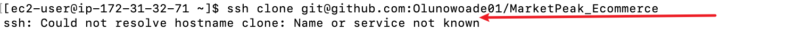

# MarketPeak_Ecommerce

The goal of this project is to create an e-commerce website for an online marketplace, featuring product listings, a shopping cart, and user authentication.

> I created a folder for the MarketPeak_Ecommerce project using the mkdir command.

## step 1

## Step 2

> I downloaded a website template from the recommended source, then staged and committed it to the Git repository.

Using the commands:
git add .
git config
git commit

## Step 3 

> After initializing the Git repository and adding the website template, I pushed the code to a remote repository on GitHub. I created the repository without including a README or .gitignore file.

Using the command:
`git remote add origin` 

# Step 4 

 > In Step 4, I connected my EC2 keypair to the terminal. To do this, I navigated to the directory where the keypair was stored.

Using the cd command:
cd ~/path/to/keypair

 

 ## Step 5 

 > In Step 5, I cloned the repository to my Linux server and set the correct permissions for the keypair.

Using the following commands:
ssh-keygen
ssh -i keypair server-ip

## step 6 

> In Step 6, I added my EC2 public SSH key to my GitHub account.

## Step 7 

> In Step 7, I generated the SSH URL to clone the repository.

## Step 8 

> This process shows the SSH public key pair that I used to clone the repository on my EC2 server.

## Step 9

> This process shows the SSH public key pair that I used to clone the repository on my EC2 server.

## Step 10 

> This step shows the error I encountered while trying to clone the GitHub repository on my EC2 server using SSH.

## Step 11 

> After adding my SSH public key to GitHub, I successfully cloned the repository to my EC2 server using the git clone command.

## Step 12 

> After cloning the Git repository, I updated the Apache HTTP server on my EC2 instance to enable it to host the MarketPeak e-commerce site.

Using the command:
sudo yum update -y

## Step 13 

> After updating the Apache HTTP server, I installed the server to ensure it’s ready for use.

Using the command:
sudo yum install httpd

## Step 14

> After updating and installing Apache, I configured the server and set up the web directory for the website.

Using the commands:
sudo rm -rf
sudo cp -r ~

## Step 15

> Finally, the Apache web server is ready to serve the website. However, I needed to reload the HTTP service for it to work properly.

Using the command:
sudo systemctl reload httpd

